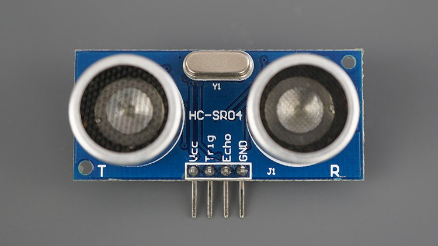
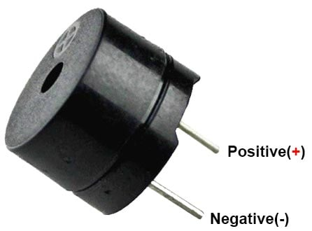

## 🧠 HC-SR04 Distance Sensor + 🔊 Active Buzzer (Obstacle Detection)

This chapter gives you an overview of the hardware used for **obstacle detection** in your Raspberry Pi 5 car project.  
It combines two components:

📏 **HC-SR04 Distance Sensor**  


🔊 **Active Buzzer**  


These two work together to detect nearby obstacles. When the car gets **too close (less than 20 cm)** to an object, the buzzer starts beeping and the **web interface shows a warning message**.

 💡 This feature is only available in:
 - `iPad Buttons` mode  
 - `Switch Controller` mode  
 
 ❗  It is **disabled** in `Voice Control` and `Gesture Recognition` modes.

---

### 🔌 Pin Connections

#### 🧭 HC-SR04 Distance Sensor

| Pin Name | Raspberry Pi 5 Pin |
|----------|---------------------|
| VCC      | 5V                  |
| TRIG     | GPIO 16             |
| ECHO     | GPIO 26             |
| GND      | GND                 |

---

#### 🔔 Active Buzzer

| Pin Name | Raspberry Pi 5 Pin |
|----------|---------------------|
| Ground   | GND                 |
| Signal   | GPIO 6              |

---

### 🧠 Obstacle Detection Logic

The code logic checks the distance using the sensor. If something is **closer than 20 cm**, the buzzer **beeps continuously**, and the **web interface displays "⚠️ Warning: Too Close!"** in the obstacle alert box.

```python
# --- GPIO Pin Definitions ---
TRIGGER_PIN = 16  # HC-SR04 Trigger
ECHO_PIN = 26     # HC-SR04 Echo
BUZZER_PIN = 6    # Active Buzzer

# --- Initialize GPIO Zero Devices ---
distance_sensor = DistanceSensor(echo=ECHO_PIN, trigger=TRIGGER_PIN, max_distance=4)
buzzer = DigitalOutputDevice(BUZZER_PIN)

def obstacle_detection_thread():
    global obstacle_warning
    while True:
        if obstacle_detection_active:
            distance = distance_sensor.distance * 100  # Convert to cm
            if distance < 20:
                buzzer.on()  # Buzzer keeps beeping
                obstacle_warning = True
            else:
                buzzer.off()
                obstacle_warning = False
        else:
            buzzer.off()
            obstacle_warning = False
        time.sleep(0.1)
```

---

If you’re interested in how the distance sensor triggers the
**"⚠️ Warning: Too Close!"** message on the web interface,

👉 check out this chapter:
[**Web Server Overview**](Web-Server-Overview.md)


