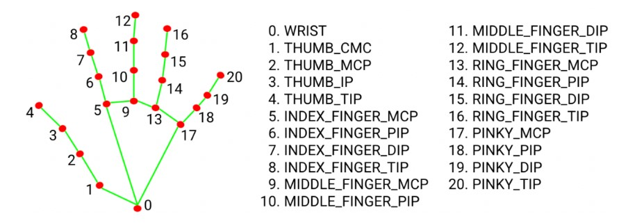
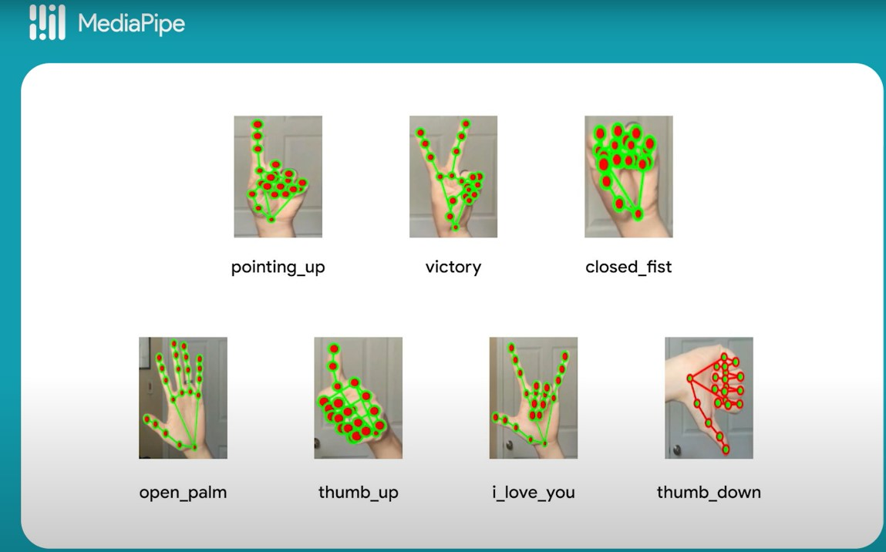

# ✋ Hand Gesture Recognition (MediaPipe)

This chapter tackles one of the most exciting (and challenging!) control modes in the smart car: **Hand Gesture Recognition** using **MediaPipe** by Google AI. It brings vision-based AI into real-world action — you move your hand, and the car responds!

---

## 🧠 What Is MediaPipe?

MediaPipe is a powerful framework created by [Google AI](https://ai.google.dev/edge/mediapipe/solutions/vision/hand_landmarker) to detect **hands**, **faces**, **gestures**, and more using just a camera and AI models.

In our project, we use the **Gesture Recognizer model** to detect hand movements and convert them into car commands like "Turn Left", "Turn Right", and "Stop".

📷 **Picture 1: Hand Landmark Detection Process**  
The webcam tracks 21 key points on your hand in real-time!



📷 **Picture 2: Google's Pre-trained Gesture Results**  
This is what the model can recognize — including **Thumb Up**, **Thumb Down**, and **Victory** gesture.



---

## 🔗 Downloading the Model

You can get the pre-trained model here (tested on Raspberry Pi 5):  
👉 [Google's MediaPipe Raspberry Pi Sample](https://github.com/google-ai-edge/mediapipe-samples/tree/main/examples/gesture_recognizer/raspberry_pi)

Once set up, you’ll see landmarks overlaying your hand in a live webcam feed!

---

## 🤝 Gesture to Action Mapping

We selected 3 gestures from Google’s default set:

| Gesture     | Action         |
|-------------|----------------|
| 👍 Thumb Up  | 🔄 Turn Left     |
| 👎 Thumb Down| 🔁 Turn Right    |
| ✌️ Victory   | ⛔ Stop Movement |

---

## 💻 Code Explanation

### ⚙️ 1. Gesture Recognizer Initialization

```python
# --- Mediapipe Setup ---
mp_drawing = mp.solutions.drawing_utils
mp_drawing_styles = mp.solutions.drawing_styles
mp_hands = mp.solutions.hands

def init_gesture_recognizer():
    global gesture_recognizer
    model_path = "/home/jacky/mediapipe-samples/examples/gesture_recognizer/raspberry_pi/gesture_recognizer.task"
    base_options = python.BaseOptions(model_asset_path=model_path)
    options = vision.GestureRecognizerOptions(
        base_options=base_options,
        running_mode=vision.RunningMode.IMAGE,
        num_hands=1,
        min_hand_detection_confidence=0.5,
        min_hand_presence_confidence=0.5,
        min_tracking_confidence=0.5
    )
    gesture_recognizer = vision.GestureRecognizer.create_from_options(options)

init_gesture_recognizer()
```

---

### 🎯 2. Gesture Recognition Thread

```python
def gesture_recognition_thread():
    global current_gesture_command
    while True:
        if gesture_active:
            success, frame = camera.read()
            if success:
                rgb_frame = cv2.cvtColor(frame, cv2.COLOR_BGR2RGB)
                mp_image = mp.Image(image_format=mp.ImageFormat.SRGB, data=rgb_frame)
                result = gesture_recognizer.recognize(mp_image)
                if result.gestures:
                    category_name = result.gestures[0][0].category_name
                    if category_name == "Thumb_Up":
                        current_gesture_command = "turn_left"
                    elif category_name == "Thumb_Down":
                        current_gesture_command = "turn_right"
                    elif category_name == "Victory":
                        current_gesture_command = "stop"
                    else:
                        current_gesture_command = "none"
                else:
                    current_gesture_command = "none"
        time.sleep(0.1)
```

---

### 🧠 3. Car Control Logic + Speed Settings

```python
# --- Speed Constants ---
MAX_PWM_SPEED = 1.0
BASE_SPEED = 0.4
TURN_SPEED = 1.0
TURN_DURATION = 0.9
STOP_DURATION_AFTER_TURN = 6.8
STOP_DURATION_VICTORY = 8.0

def gesture_car_control_thread():
    current_state = STATE_STOPPED
    state_start_time = time.time()
    stop_duration = 0
    last_command = "none"

    while True:
        if gesture_active:
            command = current_gesture_command
            if current_state == STATE_FORWARD:
                if command != last_command and command != "none":
                    if command == "turn_left":
                        current_state = STATE_TURNING_LEFT
                        turn_left(TURN_SPEED)
                        state_start_time = time.time()
                        last_command = command
                    elif command == "turn_right":
                        current_state = STATE_TURNING_RIGHT
                        turn_right(TURN_SPEED)
                        state_start_time = time.time()
                        last_command = command
                    elif command == "stop":
                        current_state = STATE_STOPPED
                        stop_motors()
                        stop_duration = STOP_DURATION_VICTORY
                        state_start_time = time.time()
                        last_command = command
                else:
                    move_forward(BASE_SPEED)
            elif current_state == STATE_TURNING_LEFT:
                if time.time() - state_start_time >= TURN_DURATION:
                    current_state = STATE_STOPPED
                    stop_motors()
                    stop_duration = STOP_DURATION_AFTER_TURN
                    state_start_time = time.time()
            elif current_state == STATE_TURNING_RIGHT:
                if time.time() - state_start_time >= TURN_DURATION:
                    current_state = STATE_STOPPED
                    stop_motors()
                    stop_duration = STOP_DURATION_AFTER_TURN
                    state_start_time = time.time()
            elif current_state == STATE_STOPPED:
                if time.time() - state_start_time >= stop_duration:
                    current_state = STATE_FORWARD
                    move_forward(BASE_SPEED)
        time.sleep(0.1)
```

---

## 🧪 Real-Time Gesture Actions

Here’s a summary of what happens when you show each gesture:

* **👍 Thumb Up:**

  * 🔄 Car turns left
  * 💡 All LEDs OFF
  * [GIF Link: Turning Left](https://example.com/gesture_left.gif)

* **👎 Thumb Down:**

  * 🔁 Car turns right
  * 💡 All LEDs OFF
  * [GIF Link: Turning Right](https://example.com/gesture_right.gif)

* **✌️ Victory Sign:**

  * ⛔ Car stops completely
  * 💡 All LEDs OFF
  * [GIF Link: Stopping with Victory Gesture](https://example.com/gesture_stop.gif)

---

## 📺 Want to Learn More?

If you're interested in **Google’s hand gesture AI** or want to see how this detection works in action, check out this video:
🎥 [Watch the Google Developer Demo](https://www.youtube.com/watch?v=EWaYOil--sQ)

---

```

Let me know when you're ready for the next chapter — or if you want help uploading those GIFs or pictures next!
```
