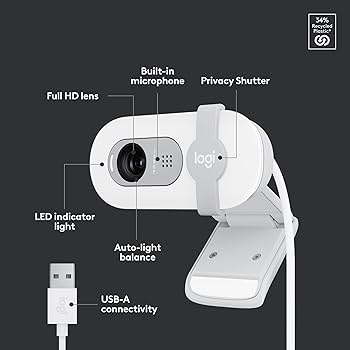

## 📷 Logitech Webcam (used for video + hand gesture detection)

This chapter covers the **Logitech Brio 100 USB Webcam**, which powers both **live video streaming** and **hand gesture detection** for the Raspberry Pi 5 smart car project.  
It offers better resolution and clarity compared to the Pi Camera Module — perfect for real-time streaming and gesture tracking.

---

### 🖼️ Webcam Overview



---

### 🔌 USB 3.0 Port Setup

To get started, simply plug the **Logitech Brio 100** into one of the Raspberry Pi 5’s **USB 3.0 ports**.  

.jpg)

Once connected, it’s ready to handle **video streaming** and **gesture recognition**!

---

### 🎥 Webcam Frame Setup & Live Streaming

The code below sets the webcam’s resolution and streams video directly to your iPad web interface.  
This works across all three modes: **iPad Buttons**, **Switch Controller**, and **Voice Recognition**.

```python
# --- Camera Setup ---
camera = cv2.VideoCapture(0)
camera.set(cv2.CAP_PROP_FRAME_WIDTH, 640)
camera.set(cv2.CAP_PROP_FRAME_HEIGHT, 480)

def gen_frames():
    with mp_hands.Hands(
        model_complexity=0,
        min_detection_confidence=0.5,
        min_tracking_confidence=0.5
    ) as hands:
        while True:
            success, frame = camera.read()
            if not success:
                break
            _, buffer = cv2.imencode('.jpg', frame, [int(cv2.IMWRITE_JPEG_QUALITY), 70])
            frame_bytes = buffer.tobytes()
            yield (b'--frame\r\nContent-Type: image/jpeg\r\n\r\n' + frame_bytes + b'\r\n')

@app.route('/video_feed')
def video_feed():
    return Response(gen_frames(), mimetype='multipart/x-mixed-replace; boundary=frame')
````

**How it works:**

* The resolution is set to **640x480** for smooth streaming.
* `gen_frames()` captures frames, compresses them as JPEG (70% quality), and streams them to `/video_feed`.
* The live feed updates seamlessly on your iPad interface.

---

### ✋ Hand Gesture Detection (Basic Setup)

This webcam is also used for **gesture recognition**, but only when "Gesture Recognition" mode is selected.
The code below activates gesture overlays using **MediaPipe**:

```python
if gesture_active:
    rgb_frame = cv2.cvtColor(frame, cv2.COLOR_BGR2RGB)
    results = hands.process(rgb_frame)
    if results.multi_hand_landmarks:
        for hand_landmarks in results.multi_hand_landmarks:
            mp_drawing.draw_landmarks(
                frame,
                hand_landmarks,
                mp_hands.HAND_CONNECTIONS,
                mp_drawing_styles.get_default_hand_landmarks_style(),
                mp_drawing_styles.get_default_hand_connections_style()
            )
```

This ensures your hand gestures (like **Thumb Up**, **Thumb Down**, and **Victory ✌️**) are tracked with colorful overlays.

---

If you’re interested in **how hand gesture recognition works**
or **how these gestures control the car**,

👉 check out this chapter:
[**Hand Gesture Recognition (MediaPipe)**](Hand-Gesture-Recognition-MediaPipe.md)


