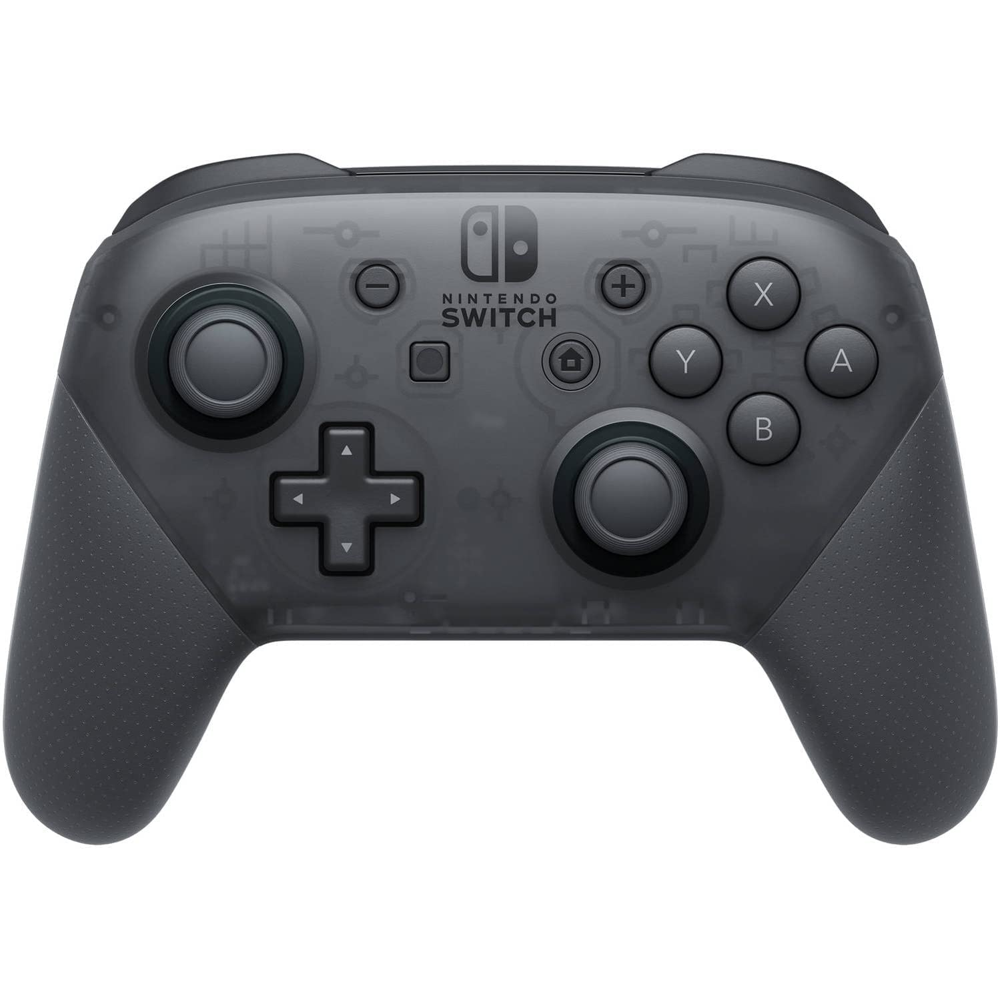
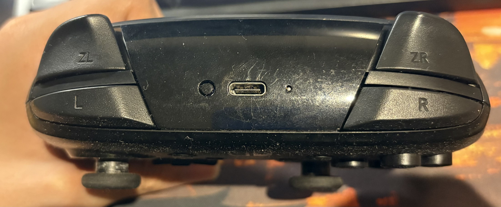

# 🎮 Nintendo Switch Pro Controller (Bluetooth)

  
<br>


This chapter introduces the **Nintendo Switch Pro Controller**—an awesome piece of hardware that brings a **gaming-style control experience** to your Raspberry Pi 5 smart car 🚗⚡.  
With Bluetooth pairing and real-time input, it’s like turning your Pi into a console!

---

### 🔄 Setup & Connection Steps

Here’s how to connect the controller step by step:

1. **Power On the Controller**  
   Press and hold the small **sync button** at the top (near the USB-C port) until the lights start blinking.

2. **Enable Bluetooth on Raspberry Pi 5**  
   Click the **Bluetooth icon** 🔵 in the top-right corner of the Pi’s desktop screen.

3. **Pair the Controller**  
   From the Bluetooth menu, select `Nintendo Switch Pro Controller` → click **Connect**.

4. **Done!**  
   The controller is now paired and ready for action. No need for MAC addresses or terminal commands 🎉

---

### ⚙️ Dynamic Device Detection

Even though your controller is connected, the system might assign a **new device number** (like `/dev/input/event14`) every time you reboot.  
Without handling this, the buttons won’t work 😵

But don’t worry — this code uses `evdev.list_devices()` to **automatically detect the correct input**:

```python
def find_pro_controller():
    found_controller = None
    found_imu_controller = None
    for path in list_devices():
        try:
            device = InputDevice(path)
            if "Pro Controller (IMU)" in device.name and "Pro Controller" in device.name:
                found_imu_controller = device
            elif "Pro Controller" in device.name:
                print(f"Found primary Nintendo Switch Pro Controller: {device.name} at {device.path}")
                return device
            else:
                device.close()
        except OSError as e:
            print(f"Warning: Could not open device {path} - {e}")
            continue
    if found_imu_controller:
        print(f"Found Pro Controller (IMU) as fallback: {found_imu_controller.name} at {found_imu_controller.path}")
        return found_imu_controller
    return None
```
This logic runs continuously in your controller input loop:

```python
def read_controller_input():
    global nintendo_controller, controller_active
    while True:
        if nintendo_controller is None:
            print("Attempting to find Pro Controller...")
            nintendo_controller = find_pro_controller()
            if nintendo_controller is None:
                print("Pro Controller not found. Retrying in 3 seconds...")
                stop_motors()
                time.sleep(3)
                continue
        # ...rest of the input reading logic here...

```
✅ This ensures even if the device number changes after a reboot, by looking for “Pro Controller” in the name. If it’s not found, it retries every 3 seconds, ensuring the car stays controllable as long as the Bluetooth connection holds. 

---

📎 If you're interested in which buttons control the car directions (Forward, Backward, Left, Right),

👉 check out this chapter: 
 [Switch Controller](switch-controller.md) 
