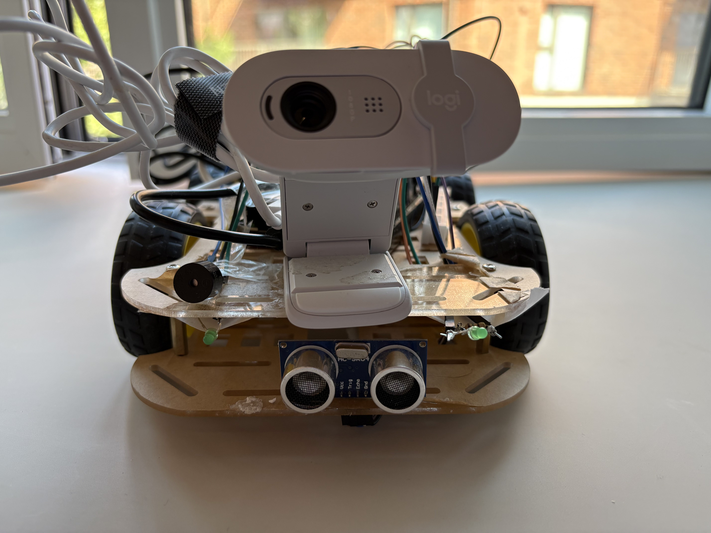
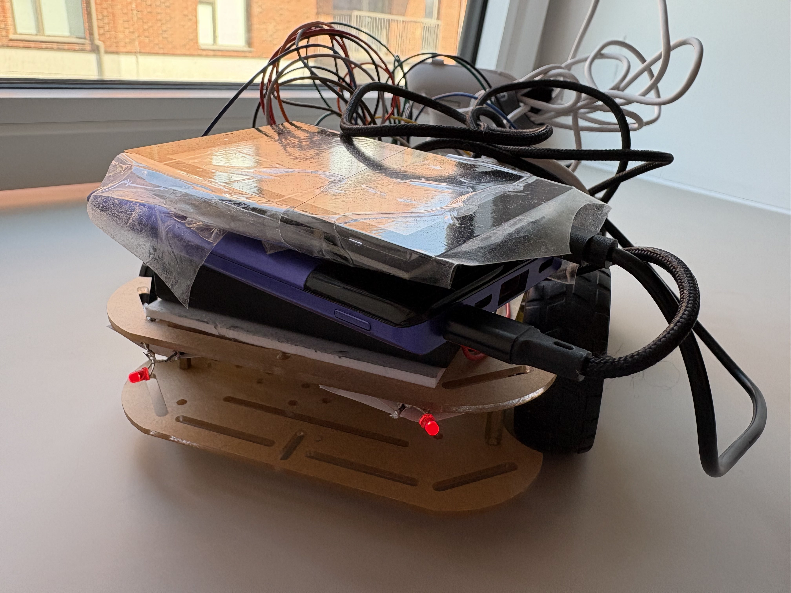
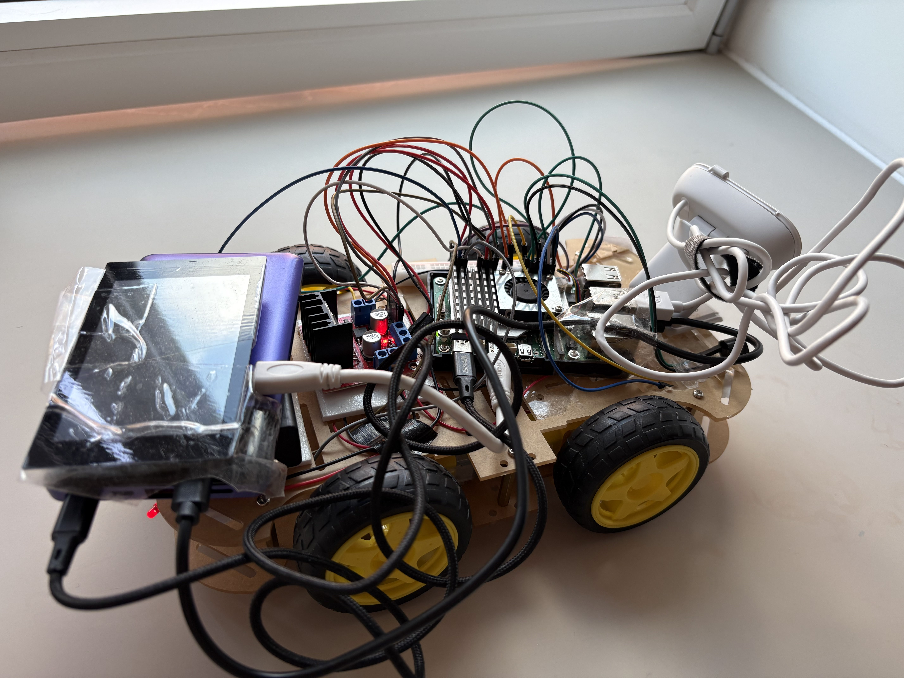
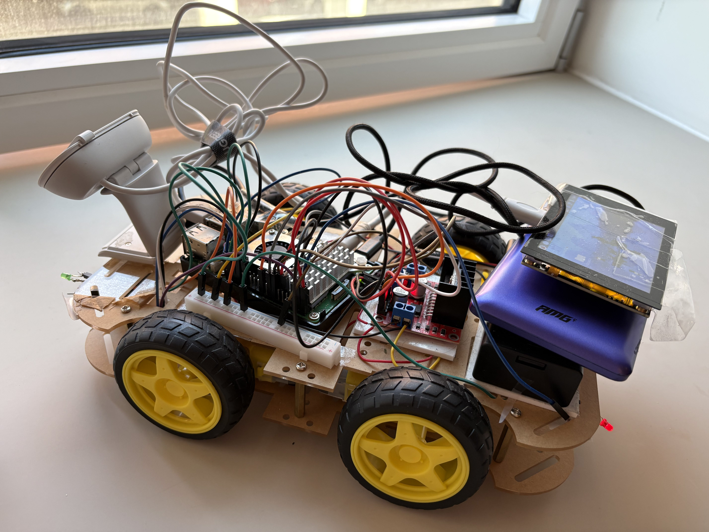

# 🚗 Raspberry Pi 5 Smart Robotic Car

This is a **smart robotic car** built using Raspberry Pi 5.  
It supports multiple AI-powered and manual control methods:

- 📱 **iPad Web Control** (via Flask server)
- 🎮 **Nintendo Switch Pro Controller Input**
- 🗣️ **Offline Voice Recognition** (Vosk)
- ✋ **Hand Gesture Control** (Google MediaPipe)
- 🧠 **Obstacle Detection** (Ultrasonic + Buzzer)
- 🎥 **Live Webcam Streaming** 

---
## 📁 Project Documentation

### 🔥 Full Source Code

- 🚀 [Full Raspberry Pi Python Code](Pi5car.py)

---

### 🖥️ Terminal Setup Instructions

Before running the full code, open your terminal and run the following in order:

```bash
cd ~/mediapipe-samples/examples/gesture_recognizer/raspberry_pi
source venv_mediapipe/bin/activate
cd ~/Documents
python Pi5car.py
```
---
## 🧠 Raspberry Pi 5 Overview
*(Explains setting up web server , how devices connect to Pi5 to access the full web control interface for the car.)*
- 🔗 [Raspberry Pi 5 Overview](Raspberry-Pi5-Overview.md)


---
## 🌐 Web Server Feature Overview

*(Explains live MJPEG webcam stream, car control buttons, dropdown menu for selection mode , obstacle warning box, voice recognition feedback, and gesture detection camera input.)*

- 🌐 [Web Server Overview](Web-Server-Overview.md)

---
## 🛠️ Hardware Components Overview

- 🧠 [Raspberry Pi 5](#)
- ⚙️ [L298N Motor Driver with 4 Wheels](#)
- 🎮 [Nintendo Switch Pro Controller (Bluetooth)](#)
- 🎤 [Logitech Webcam Microphone (used for Vosk)](#)
- 📷 [Logitech Webcam (used for video + hand gesture detection)](#)
- 📏 [HC-SR04 Distance Sensor + 🔊 Active Buzzer (Obstacle Detection)](#)
- 💡 [Front/Back LEDs (Green for Forward, Red for Backward)](#)

---
## ⚡ Control Modes (Features)

### 1️⃣ [iPad Web Control](#)
Use on-screen directional buttons (↑ ↓ ← →) with live feedback.

### 2️⃣ [Switch Controller](#)
ZR = Forward, ZL = Backward, D-Pad Left/Right to turn.

### 3️⃣ [Offline Voice Recognition (Vosk)](#)
Supports: “front”, “back”, “left”, “right”, “stop” — runs fully offline!

### 4️⃣ [Hand Gesture Recognition (MediaPipe)](#)
- 👍 Thumb Up → Turn Left  
- 👎 Thumb Down → Turn Right  
- ✌️ Victory → Stop  

---
## 📌 Pin Connections & Hardware

- 🗺️ [Pi5 Full Car Pin Mappings](#)  
*(Includes all wiring tables for L298N motor driver, 4 motor wheels, battery power source, LEDs, distance sensor, and Logitech webcam.)*
---
## 📸 Pi5 Smart Car Pictures

**🔹 Front View**  


**🔹 Back View**  


**🔹 Left Side View**  


**🔹 Right Side View**  


