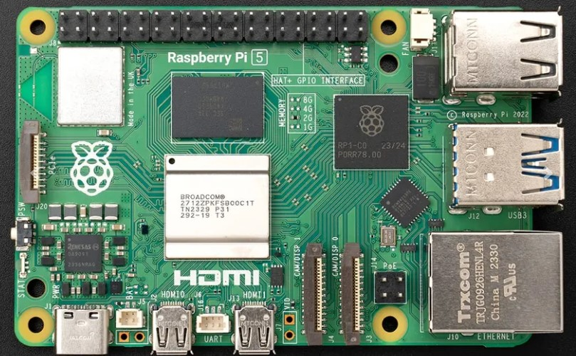

# 🧠 Raspberry Pi 5 Overview

 

The **Raspberry Pi 5** acts as the brain of this smart robotic car. It:

- Runs a Flask web server 💻  
- Creates a local Wi-Fi network or connects to existing networks 📡  
- Lets other devices (like an iPad) control the car remotely via a browser 🌐

---

## 🌐 Web Server Function

The Pi hosts a Flask-based server, allowing users to connect (e.g. from an iPad) and control the car in real-time using directional buttons, dropdown menus, and feedback boxes.

Here’s the basic code that starts the web server:

```python
import flask
app = Flask(__name__)

@app.route('/')
def index():
    return render_template_string(html)

if __name__ == '__main__':
    app.run(host='0.0.0.0', port=5000, threaded=True)
```
## 🚀 Activation Steps

1. **Turn off the Raspberry Pi 5 Wi-Fi** to ensure a clean setup.  
    <!-- Replace with your actual image filename later -->

2. **Open a terminal window** and enter the following three lines of code **before running the Pi 5 car code**:

    ```bash
    sudo systemctl stop wpa_supplicant
    sudo ifconfig wlan0 down
    sudo ifconfig wlan0 192.168.4.1
    ```

3. **On your iPad**, go to **Settings > Wi-Fi** and look for a network named `"Pi-Car"`.

   Connect to it to access the web control interface from Safari or Chrome.

    <!-- Replace with your actual image filename later -->

4. **Open Safari or Chrome** on the iPad and go to:
   
    ```bash
    http://192.168.4.1:5000
    ```
You will see the full web control interface for the car. 🚗📲
