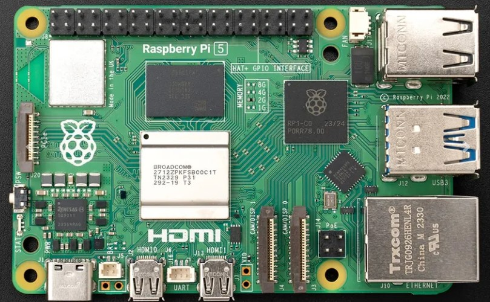

# 🧠 Raspberry Pi 5

### 📌 GPIO Pinout Reference

---

### 🖼️ Physical Raspberry Pi 5 (Top View)

---

### 🧾 Why Raspberry Pi 5?

The **Raspberry Pi 5** is the brain of the entire smart car system. It handles:

* 🧠 Running Python code (Flask server, camera processing, motor control)
* 📶 Acting as a **Wi-Fi access point** for iPad control
* 📸 Streaming video from a USB webcam
* 🗣️ Handling voice and gesture recognition
* 🎮 Receiving input from external devices like a Nintendo Switch controller

Compared to older models, **Pi 5 offers faster CPU, more RAM**, and **USB 3.0**, which helps with better webcam and multitasking performance.

---

### 🔌 GPIO Pinout

To connect the components (like L298N, ultrasonic sensor, USB webcam), the Pi’s **40-pin GPIO header** is used. Here’s a pinout diagram to help with wiring reference:

📎 *See image above or [Pinout.xyz](https://www.hackatronic.com/raspberry-pi-5-pinout-specifications-pricing-a-complete-guide/) for more.*

---

### 📸 Real Hardware Photo

The right-side photo shows the actual Raspberry Pi 5 used in the project. It includes:

* ⚡ A USB-C power supply
* 🧲 MicroSD card (with Raspberry Pi OS)
* 🔌 HDMI port for debugging
* 📷 USB webcam plugged in
* 💻 Optional fan or heat sink for cooling

---
📎 If you're new to Raspberry Pi and want to learn how to set it up step-by-step,  
👉 check out the official beginner guide here:  
🔗 [Getting Started with Raspberry Pi 5](https://www.raspberrypi.com/documentation/computers/getting-started.html)

