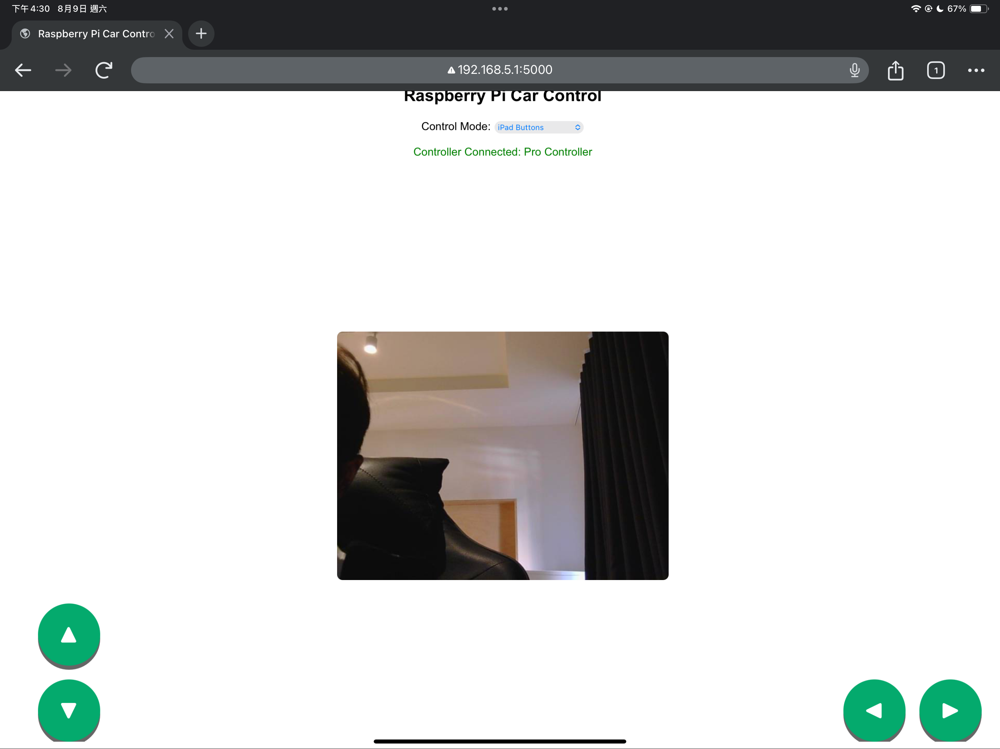
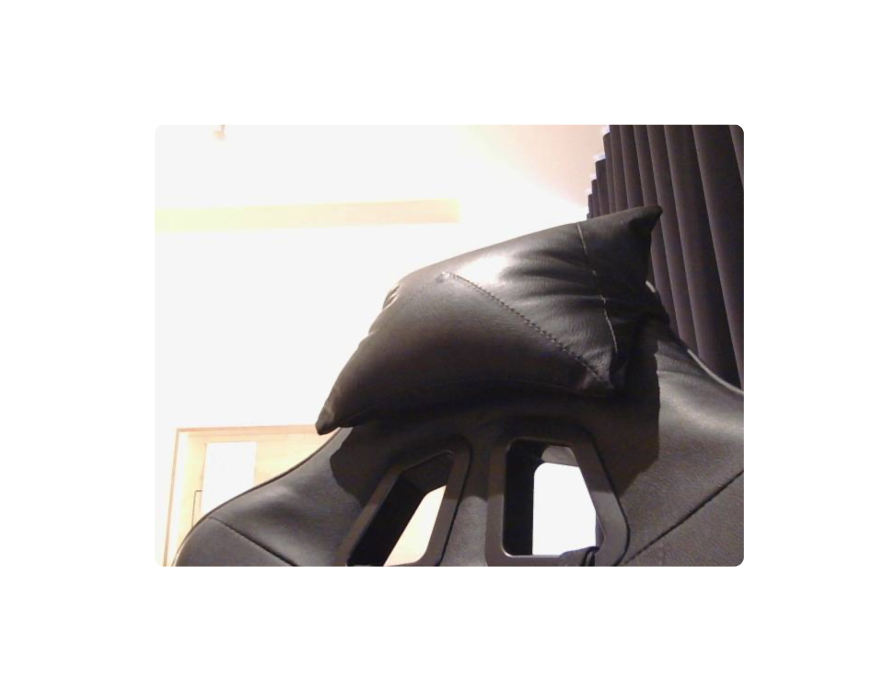

# 🌐 Web Server Overview

 <!-- Replace with actual filename -->

This is the **web interface** you'll see on your iPad after connecting to the Raspberry Pi 5 network.

---

### 🖼️ Title Area

One of the first things you’ll notice is the floating animated title at the top of the page:


---
## 🧩 Features

### 🔽 1. Dropdown Mode Menu

The first feature is a **dropdown menu** that lets you choose from 4 different control modes:

1. 📱 iPad Buttons  
2. 🎮 Switch Controller  
3. 🗣️ Speech Recognition  
4. ✋ Gesture Recognition  

When you tap the menu on your iPad, it will look like this:

 <!-- replace with your image later -->

Here’s the code used to create the dropdown:

```html
<select id="controlMode" onchange="changeControlMode()">
  <option value="ipad_buttons">iPad Buttons</option>
  <option value="switch_controller">Switch Controller</option>
  <option value="speech_recognition">Voice Control</option>
  <option value="gesture_recognition">Gesture Recognition</option>
</select>
```
---
### 📷 2. Webcam Streaming to the Web

This feature streams **live video** from the Logitech webcam directly to the center of the web server UI — right on your iPad screen!

📺 It’s super helpful for:
- Seeing the car’s surroundings in real time  
- Monitoring movement while using iPad Buttons, Switch Controller, Voice, or Gesture  
- Keeping full control without physically chasing the car around 😊

 <!-- Replace with your actual screenshot -->

The video stream stays fixed at the center of the page and doesn’t disappear when you switch between control modes.


#### 💻 Code Behind the Stream Layout:

```html
<div class="video-container">
  
</div>
```
- The video-container class centers the webcam nicely.
- The camera element makes sure the stream stays at 360px height and adapts to screen size without distortion.
---
📎 If you're interested in **how the Logitech webcam was configured**,  
**how the MJPEG stream is sent to the web**,  
and **how it also detects hand gestures**...

👉 check out this chapter:  
🔗 [Logitech Webcam (used for video + hand gesture detection)](Logitech-Webcam.md)
