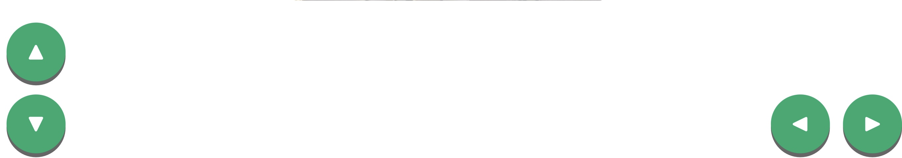

# 🌐 Web Server Overview

 <!-- Replace with actual filename -->

This is the **web interface** you'll see on your iPad after connecting to the Raspberry Pi 5 network.

---

### 🖼️ Title Area

One of the first things you’ll notice is the floating animated title at the top of the page:


---
## 🧩 Features

### 🔽 1. Dropdown Mode Menu

The first feature is a **dropdown menu** that lets you choose from 4 different control modes:

1. 📱 iPad Buttons  
2. 🎮 Switch Controller  
3. 🗣️ Speech Recognition  
4. ✋ Gesture Recognition  

When you tap the menu on your iPad, it will look like this:

 <!-- replace with your image later -->

Here’s the code used to create the dropdown:

```html
<select id="controlMode" onchange="changeControlMode()">
  <option value="ipad_buttons">iPad Buttons</option>
  <option value="switch_controller">Switch Controller</option>
  <option value="speech_recognition">Voice Control</option>
  <option value="gesture_recognition">Gesture Recognition</option>
</select>
```
---
### 📷 2. Webcam Streaming to the Web

This feature streams **live video** from the Logitech webcam directly to the center of the web server UI — right on your iPad screen!

📺 It’s super helpful for:
- Seeing the car’s surroundings in real time  
- Monitoring movement while using iPad Buttons, Switch Controller, Voice, or Gesture  
- Keeping full control without physically chasing the car around 😊

 <!-- Replace with your actual screenshot -->

The video stream stays fixed at the center of the page and doesn’t disappear when you switch between control modes.


#### 💻 Code Behind the Stream Layout:

```html
<div class="video-container">
  
</div>
```
- The video-container class centers the webcam nicely.
- The camera element makes sure the stream stays at 360px height and adapts to screen size without distortion.
---
📎 If you're interested in **how the Logitech webcam was configured**,  
**how the MJPEG stream is sent to the web**,  
and **how it also detects hand gestures**...

👉 check out this chapter:  
🔗 [Logitech Webcam (used for video + hand gesture detection)](Logitech-Webcam.md)

---
### 🖱️ 3. iPad Web Control Buttons

This feature gives you a **touch-based controller** right on your iPad!  
When you choose **"iPad Buttons"** from the dropdown menu, you’ll see four buttons appear:

- ▲ Move Forward (top-left)
- ▼ Move Backward (bottom-left)
- ◀ Turn Left (bottom-right)
- ▶ Turn Right (top-right)



Switch to any other mode (like 🎮 Controller, 🗣️ Voice, or ✋ Gesture), and these buttons will disappear automatically — super clean!


---

### 🎨 Button Style & Layout (HTML + CSS)

The design includes size, shape, color, and placement:

```html
<style>
  button {
    width: 90px;
    height: 90px;
    font-size: 36px;
    border-radius: 50%;
    border: none;
    color: white;
    background-color: #04AA6D; /* Green */
    box-shadow: 0 6px #666;
    cursor: pointer;
  }
  button:active {
    background-color: #3e8e41;
    box-shadow: 0 3px #444;
    transform: translateY(4px);
  }
</style>

<div id="ipadButtons">
  <div class="left-controls">
    <button ontouchstart="send('forward')" ontouchend="send('stop')">▲</button>
    <button ontouchstart="send('backward')" ontouchend="send('stop')">▼</button>
  </div>
  <div class="right-controls">
    <button ontouchstart="send('left')" ontouchend="send('stop')">◀</button>
    <button ontouchstart="send('right')" ontouchend="send('stop')">▶</button>
  </div>
</div>
```
### 🔁 Button Function Logic (Frontend → Backend)

When you tap a button, it sends a wireless command to the Raspberry Pi 5 to control the car using PWM (Pulse Width Modulation) for smooth motor control. Each button triggers this JavaScript function:

```html
<script>
  function send(cmd) {
    fetch('/' + cmd);
  }
</script>
```
Then it calls Flask routes like this on the Raspberry Pi:
```python
@app.route('/forward')
def forward_route():
    if current_control_mode == 'ipad_buttons':
        move_forward(MAX_PWM_SPEED)  # Uses PWM to set motor speed
    return '', 200

@app.route('/backward')
def backward_route():
    if current_control_mode == 'ipad_buttons':
        move_backward(MAX_PWM_SPEED)
    return '', 200

@app.route('/left')
def left_route():
    if current_control_mode == 'ipad_buttons':
        turn_left(MAX_PWM_SPEED)
    return '', 200

@app.route('/right')
def right_route():
    if current_control_mode == 'ipad_buttons':
        turn_right(MAX_PWM_SPEED)
    return '', 200

@app.route('/stop')
def stop_route():
    if current_control_mode == 'ipad_buttons':
        stop_motors()
    return '', 200
```
### ⚙️ What Happens Internally?
Example motor function:
```python
def move_forward(speed):
    in1.on(); in2.off()
    in3.off(); in4.on()
    ena.value = speed  # PWM speed control
    enb.value = speed
    green_led1.on()
    green_led2.on()
    print(f"Action: Forward at {speed:.2f}")
```
- The buttons send fetch commands like `/forward`
- Flask receives it and checks the current mode
- Then it uses **PWM signals** to spin the wheels
- When you lift your finger → `/stop` is sent → motors stop smoothly
---
📎 If you're curious about how **PWM signals** control the motors  
and how the **L298N driver moves 4 wheels forward/backward**...

👉 check out this chapter:  
🔗 [L298N Motor Driver with 4 Wheels](L298N-Motor.md)

---
### 🟧 4. Obstacle Warning Box

This feature pops up a warning to let you know the car is getting too close to an obstacle — helping prevent crashes!

📸 Screenshot of the warning box:


---

The warning message ("**Warning: Too Close!**") only shows when you're using **iPad Buttons** or **Switch Controller** mode. It’s **tied directly to the distance sensor** — when the car gets too close (under 20 cm), this message appears on the screen.

💡 Here's the HTML used for the warning box:

```html
<div id="obstacleWarningBox">
  <span id="obstacleWarningText">Warning: Too Close!</span>
</div>
```

---

### 🔄 How the Distance Sensor Triggers the Warning

This section shows how the system constantly monitors the distance using a thread:

```python
def obstacle_detection_thread():
    global obstacle_warning
    while True:
        if obstacle_detection_active:
            distance = distance_sensor.distance * 100  # Convert to cm
            if distance < 20:
                buzzer.on()  # Buzzer beeps
                obstacle_warning = True
            else:
                buzzer.off()
                obstacle_warning = False
        else:
            buzzer.off()
            obstacle_warning = False
        time.sleep(0.1)
```

👆 When distance is under **20 cm**:

* ✅ `obstacle_warning = True`
* ✅ Buzzer turns on
* ✅ Web warning box will show!

---

The web fetches this status using a Flask route (Flask route sends this status to the web server) :

```python
@app.route('/get_obstacle_status')
def get_obstacle_status():
    return jsonify({'warning': obstacle_warning}), 200
```

And the web interface shows/hides the warning like this:

```html
<script>
  function updateObstacleWarning() {
      fetch('/get_obstacle_status')
          .then(response => response.json())
          .then(data => {
              const obstacleWarningBox = document.getElementById('obstacleWarningBox');
              const obstacleWarningText = document.getElementById('obstacleWarningText');
              if (data.warning) {
                  obstacleWarningText.textContent = "Warning: Too Close!";
                  obstacleWarningBox.style.display = 'block';
              } else {
                  obstacleWarningBox.style.display = 'none';
              }
          })
          .catch(error => console.error('Error fetching obstacle status:', error));
  }
</script>
```

---

📌 In summary:

* Distance is monitored continuously using a background thread.
* If distance < 20 cm → `obstacle_warning = True`
* This value is fetched and used to show or hide the web warning box.
* It also controls the buzzer, but we'll explain that more in a different chapter.

---

📎 If you're interested in how the **distance sensor calculates distance**,
or how the **buzzer beeps** when the car is too close...

👉 check out this chapter:
🔗 [HC-SR04 Distance Sensor + 🔊 Active Buzzer (Obstacle Detection)](HC-SR04-Buzzer.md)

---
Perfect! Here's the improved and polished version of your **📢 Voice Recognition Feedback Box** section, formatted nicely for your GitHub markdown with emojis, clear explanation, a screenshot placeholder, and a redirect to the Vosk chapter at the end.

---

## 📢 5. Voice Recognition Feedback Box

📸 Screenshot of the feedback display:


This feedback box appears **only when "Voice Control" is selected** from the dropdown menu.
It lets you **visually confirm what voice command** you just spoke — super helpful for making sure the car heard you correctly!

---

### 🧠 How It Works:

* 🕹️ When you're in **Voice Control** mode, the box starts by displaying:
  `"Ready for command: Say 'front', 'back', 'left', 'right', or 'stop'"`

* 🎤 When you say one of the 5 commands (like `"front"`), the box updates to show:
  `"Front"` (capitalized)

* ⏳ After 2 seconds, it resets back to the original "Ready for command" message

---

### 🧩 Code for the Feedback Box

#### 📦 HTML

```html
<div id="speechHistoryBox">
  Ready for command: Say 'front', 'back', 'left', 'right', or 'stop'
</div>
```

#### 🧠 JavaScript Logic

```html
<script>
  let speechHistoryInterval;

  document.addEventListener('DOMContentLoaded', () => {
      if (!speechHistoryInterval) {
          speechHistoryInterval = setInterval(updateSpeechHistory, 500);
      }
  });

  function updateSpeechHistory() {
      const speechHistoryBox = document.getElementById('speechHistoryBox');
      fetch('/get_speech_history')
          .then(response => response.json())
          .then(data => {
              if (data.command && data.command !== speechHistoryBox.dataset.lastCommand) {
                  speechHistoryBox.textContent = data.command.charAt(0).toUpperCase() + data.command.slice(1);
                  speechHistoryBox.dataset.lastCommand = data.command;

                  if (speechDisplayTimeout) clearTimeout(speechDisplayTimeout);

                  speechDisplayTimeout = setTimeout(() => {
                      speechHistoryBox.textContent = "Ready for command: Say 'front', 'back', 'left', 'right', or 'stop'";
                      speechHistoryBox.dataset.lastCommand = '';
                  }, 2000);
              }
          })
          .catch(error => {
              console.error('Error fetching speech history:', error);
              speechHistoryBox.textContent = 'Speech system error.';
          });
  }
</script>
```

#### 🛠️ Flask Route

```python
@app.route('/get_speech_history')
def get_speech_history():
    if not speech_history_queue.empty():
        command = speech_history_queue.get_nowait()
        return jsonify({'command': command}), 200
    return jsonify({'command': None}), 200
```

---

### ✅ Summary:

* 🧠 Always starts with a helpful message reminding you of available commands
* 🗣️ Updates in real time when one of the five commands is recognized
* ⏱️ After a short delay, resets to prompt the next voice input

---

📎 If you're curious about:

* 🧠 **How offline speech recognition works with Vosk**
* 🚗 **How the car moves in response to voice commands**

👉 check out this chapter:
🔗 [Offline Voice Recognition (Vosk)](Offline-Voice-Recognition-Vosk.md)

---

Let me know if you want help generating the actual screenshot or writing the next section!
