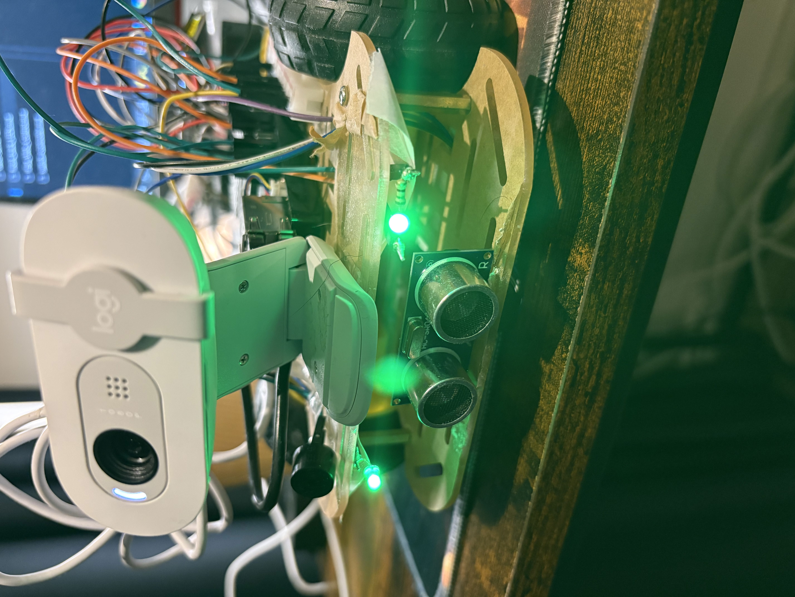
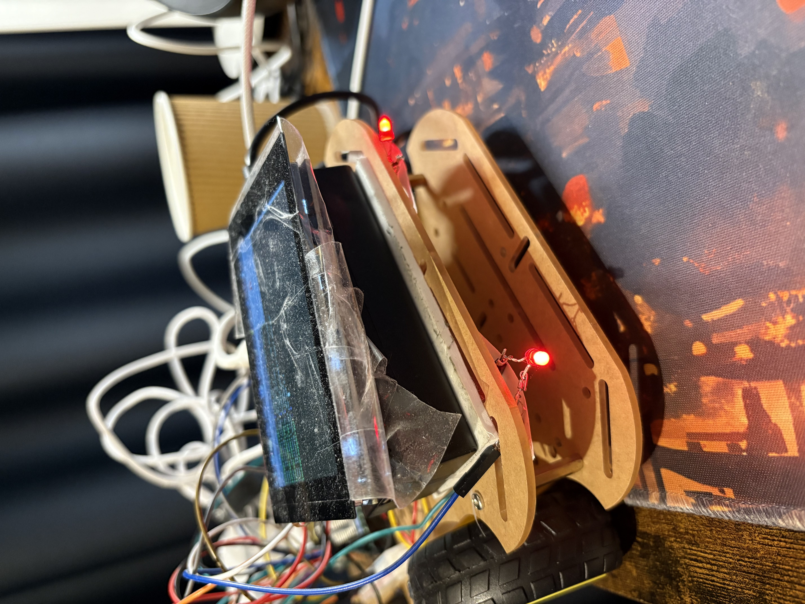

Absolutely! Here's your improved **Front/Back LEDs** chapter written in a more beginner-friendly and fun style using ✨ emojis, clear formatting, and keeping all the technical detail (code + pinout + images):

---

````markdown
## 🚗 Front/Back LEDs (Green = Forward, Red = Backward)

This chapter gives a quick look at the **LED indicators** that show your car’s direction in real-time! These are small but super helpful parts of your Raspberry Pi 5 smart car project.

---

### 🔋 Front View – Green LEDs  
These two green LEDs turn **ON when the car goes forward**.  


---

### 🔋 Back View – Red LEDs  
These red LEDs light up **when the car moves backward**.  


---

🟢 Green = Forward  
🔴 Red = Backward  
⚫ Off = Turn Left / Right / Stop

These LEDs are **enabled in all modes**:
- ✅ iPad Buttons  
- ✅ Switch Controller  
- ✅ Voice Control  
- ✅ Gesture Recognition  

So no matter how you’re controlling the car, you can **always see which direction it’s heading**!

> 💡 **Note:** The LEDs will **stay OFF** when the car is turning left/right or is stopped.

---

### 📌 Pin Connections

#### 🟢 Green LEDs (Front)

| LED         | Raspberry Pi 5 Pin |
|-------------|--------------------|
| Green LED 1 | GPIO 20            |
| Green LED 2 | GPIO 21            |

---

#### 🔴 Red LEDs (Back)

| LED       | Raspberry Pi 5 Pin |
|-----------|--------------------|
| Red LED 1 | GPIO 2             |
| Red LED 2 | GPIO 3             |

---

### 🧠 LED Operation Code

The code below turns the green or red LEDs **ON or OFF** depending on the car’s movement.

```python
# --- GPIO Pin Definitions ---
GREEN_LED1_PIN = 20  # Front green LED 1
GREEN_LED2_PIN = 21  # Front green LED 2
RED_LED1_PIN = 2     # Back red LED 1
RED_LED2_PIN = 3     # Back red LED 2

# --- Initialize GPIO Zero Devices ---
green_led1 = DigitalOutputDevice(GREEN_LED1_PIN)
green_led2 = DigitalOutputDevice(GREEN_LED2_PIN)
red_led1 = DigitalOutputDevice(RED_LED1_PIN)
red_led2 = DigitalOutputDevice(RED_LED2_PIN)

def move_forward(speed):
    in1.on(); in2.off()
    in3.off(); in4.on()
    ena.value = speed
    enb.value = speed
    green_led1.on()  # Green ON
    green_led2.on()
    red_led1.off()   # Red OFF
    red_led2.off()
    print(f"Action: Forward at {speed:.2f}")

def move_backward(speed):
    in1.off(); in2.on()
    in3.on(); in4.off()
    ena.value = speed
    enb.value = speed
    green_led1.off()
    green_led2.off()
    red_led1.on()     # Red ON
    red_led2.on()
    print(f"Action: Backward at {speed:.2f}")

def turn_left(speed):
    in1.on(); in2.off()
    in3.off(); in4.off()
    ena.value = speed
    enb.value = 0.0
    green_led1.off()  # All LEDs OFF
    green_led2.off()
    red_led1.off()
    red_led2.off()
    print(f"Action: Left (L:{speed:.2f}, R:0.0)")

def turn_right(speed):
    in1.off(); in2.off()
    in3.off(); in4.on()
    ena.value = 0.0
    enb.value = speed
    green_led1.off()  # All LEDs OFF
    green_led2.off()
    red_led1.off()
    red_led2.off()
    print(f"Action: Right (L:0.0, R:{speed:.2f})")

def stop_motors():
    in1.off(); in2.off()
    in3.off(); in4.off()
    ena.off()
    enb.off()
    green_led1.off()  # All LEDs OFF
    green_led2.off()
    red_led1.off()
    red_led2.off()
    print("Action: Stop")
````

---

🧠 **How it works:**

* When `move_forward()` runs → Green LEDs turn ON 🔛
* When `move_backward()` runs → Red LEDs turn ON 🔛
* When turning left/right or stopping → **All LEDs turn OFF** ⚫

Simple, clean, and works across all control modes! ✅

```

Let me know when you're ready to write the **"Hand Gesture Recognition (MediaPipe)"** chapter next or upload the real image filenames so we can replace the placeholders like `assets/front_green_leds.jpg`.
```
