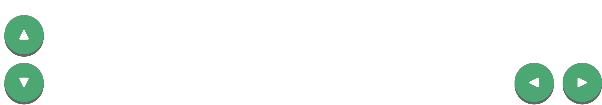

## 📱 iPad Web Control

This chapter introduces the **first control mode** in the dropdown menu: **iPad Buttons Mode**. With this feature, you can use your iPad (or any device with a browser) to control the car easily using on-screen buttons — just like a remote control! 🚗✨

You’ll see:
- 🔼 Four directional buttons (Up, Down, Left, Right)
- 📷 A live camera stream from the car
- ⚠️ A warning box when the car gets too close to an obstacle

Let’s break it down into four parts based on what each button does:

---

### 🔼 Part 1: Up Arrow Button (Forward)

When you press the **up arrow**:
- 🚗 The car **moves forward**
- 💡 **Front green LEDs turn ON**
- 👀 Great for moving straight ahead confidently!

🎞️ GIF: [Car Moving Forward](https://example.com/forward_gif.gif)

---

### 🔽 Part 2: Down Arrow Button (Backward)

When you press the **down arrow**:
- 🚗 The car **moves backward**
- 🔴 **Back red LEDs light up**
- 🛑 Helps you reverse safely and visibly

🎞️ GIF: [Car Moving Backward](https://example.com/backward_gif.gif)

---

### ◀️ Part 3: Left Arrow Button (Turn Left)

When you press the **left arrow**:
- ↩️ The car **turns left**
- 💡 All **LEDs stay OFF**

🎞️ GIF: [Car Turning Left](https://example.com/left_gif.gif)

---

### ▶️ Part 4: Right Arrow Button (Turn Right)

When you press the **right arrow**:
- ↪️ The car **turns right**
- 💡 All **LEDs stay OFF**

🎞️ GIF: [Car Turning Right](https://example.com/right_gif.gif)

---

 📝 If you're interested in **how tapping a button wirelessly sends a command to the Pi 5 through Flask** 

 👉 check out this chapter:
[Web Server Overview](Web-Server-Overview.md).

