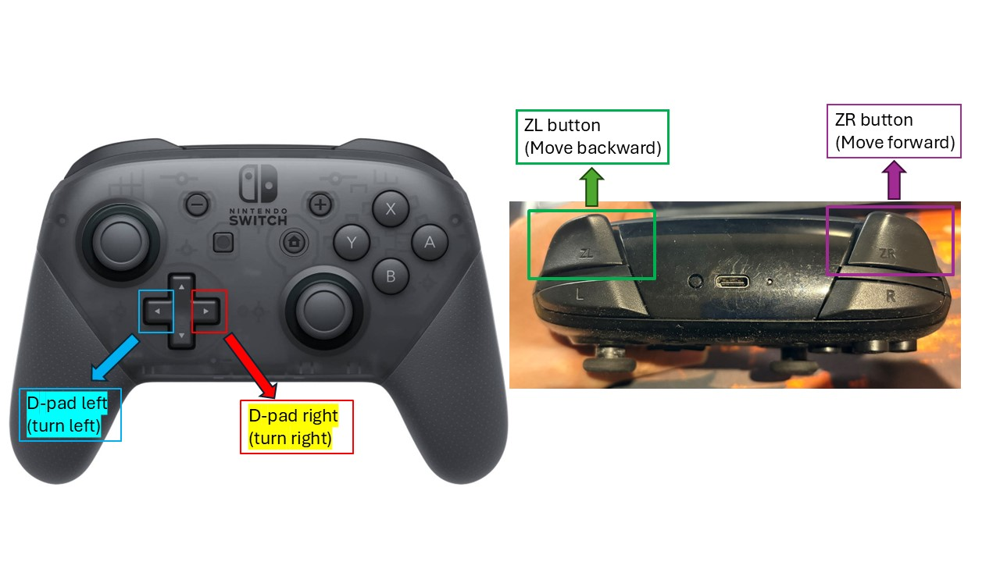
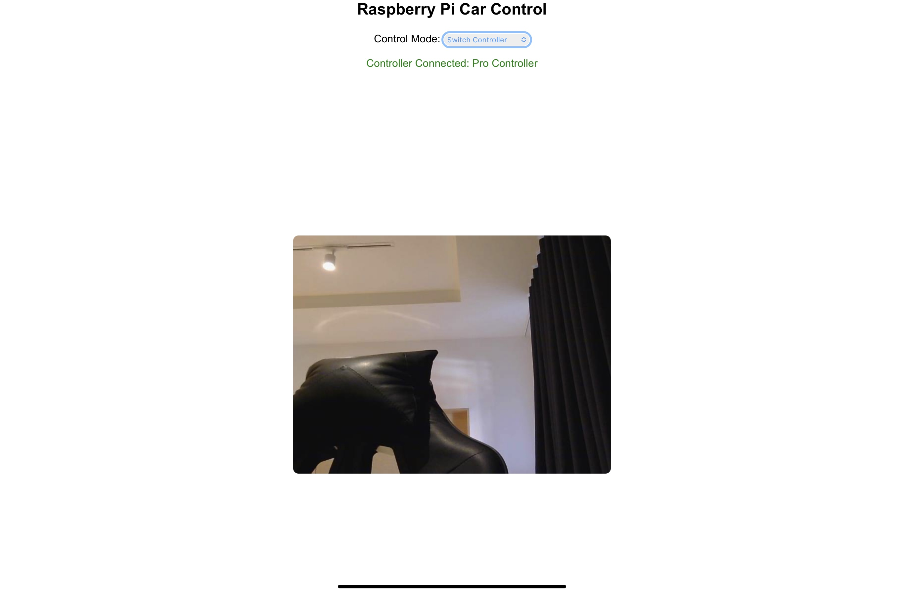

## 🎮 Switch Controller Mode

This chapter introduces the **"Switch Controller"** mode from the dropdown menu, allowing you to control your Raspberry Pi 5 car using a **Nintendo Switch Pro Controller**! Super fun, super wireless! 🔋🚗

Let’s take a look at the controller views:

📷 Flat + Top view (steering with D-PAD left/right, forward/backward with ZR/ZL buttons ):




These four buttons are all you need:

| 🎮 Button   | 🎯 Use        |
| ----------- | ------------- |
| ZR          | Move Forward  |
| ZL          | Move Backward |
| D-PAD Left  | Turn Left     |
| D-PAD Right | Turn Right    |

---

## 🔁 How It Works

Each button press on the controller sends an **event code** to the Pi 5. Here’s the simplified breakdown:

```python
# Key event codes mapped to car controls
if event.code == 313:  # ZR = forward
    controller_state['forward'] = (event.value == 1)
elif event.code == 312:  # ZL = backward
    controller_state['backward'] = (event.value == 1)
elif event.code == 16:  # D-PAD horizontal
    if event.value == -1:
        controller_state['left'] = True
    elif event.value == 1:
        controller_state['right'] = True
    elif event.value == 0:
        controller_state['left'] = False
        controller_state['right'] = False
```

Each button is linked to a clear action in the program—no confusion, just motion!

🗂 **Event Code Summary Table:**

| Button      | Event Code |
| ----------- | ---------- |
| ZR          | 313        |
| ZL          | 312        |
| D-PAD Left  | 16 (-1)    |
| D-PAD Right | 16 (1)     |

---

## 🖥️ What the Website Looks Like in This Mode

When you choose **Switch Controller** from the dropdown menu, all on-screen buttons disappear—so your iPad screen only shows the **live streaming box** for the camera view:




---

## 🕹️ Control Actions with Emoji & GIFs

* **Pressing the ZR Button:**

  * 🚗 Car moves **forward**
  * 💡 Front green LEDs turn ON
  * ✅ Confident driving ahead!
  * 📹 [Gif Link: Car Moving Forward with ZR](https://example.com/zr_forward_gif.gif)

* **Pressing the ZL Button:**

  * 🚗 Car moves **backward**
  * 🔴 Back red LEDs turn ON
  * 🔄 Smooth reversing!
  * 📹 [Gif Link: Car Moving Backward with ZL](https://example.com/zl_backward_gif.gif)

* **Pressing the D-PAD Left:**

  * 🔄 Car turns **left**
  * 🚫 All LEDs stay OFF
  * 🧭 Sharp turning!
  * 📹 [Gif Link: Car Turning Left with D-PAD Left](https://example.com/dpad_left_gif.gif)

* **Pressing the D-PAD Right:**

  * 🔁 Car turns **right**
  * 🚫 All LEDs stay OFF
  * 🧭 Right cornering made easy!
  * 📹 [Gif Link: Car Turning Right with D-PAD Right](https://example.com/dpad_right_gif.gif)

---
